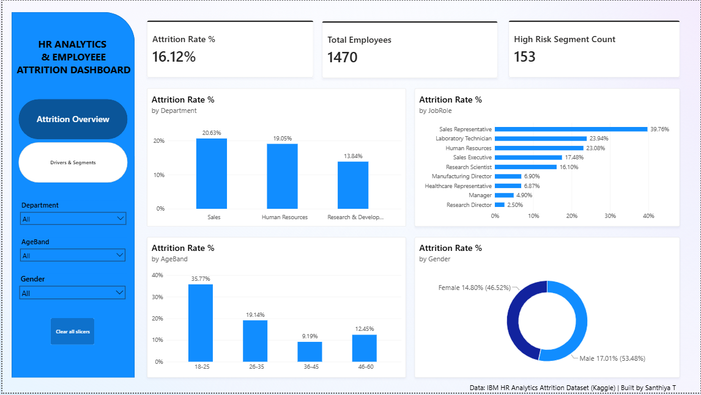

# HR Analytics & Employee Attrition Dashboard

Statistical analysis and interactive dashboard identifying key drivers of employee attrition,
using IBM's HR Analytics dataset (1,470 employees) — Python EDA with hypothesis testing,
and a 2-page Power BI dashboard featuring Key Influencers analysis.

**[Case Study PDF →](case-study/HR_Attrition_Case_Study.pdf)**

## Business Problem

Employee attrition is a major cost driver — recruiting, onboarding, and lost productivity add up
fast when turnover is high. This project answers not just "what's our attrition rate" but
"who exactly is leaving, and can we act on it specifically."

## Key Findings

- **16.12% overall attrition rate** across 1,470 employees
- **OverTime is the strongest driver** — 30.53% attrition for employees working overtime vs.
  **10.44%** for those who don't (chi-squared test, p < 0.05 — statistically significant, not
  just a visual pattern)
- Attrition is **heavily front-loaded**: 29.82% in years 0–2 of tenure vs. just 8.13% after 10+ years
- **Sales Representative** is the highest-risk role at **39.76%** attrition — more than double
  the company average
- Power BI's Key Influencers visual independently confirmed the same top 3 drivers (OverTime,
  early tenure, lower income) found in the Python statistical analysis
- Top Segments analysis identified a specific high-risk group of **99 employees with a 59.6%**
  attrition rate — nearly 6x the company baseline

## Tools & Techniques

| Layer | Tools | Techniques |
|---|---|---|
| EDA | Python, Pandas | Grouped attrition-rate analysis across categorical variables |
| Statistics | Python, SciPy | Chi-squared test of independence, correlation analysis |
| Dashboard | Power BI | DAX (CALCULATE, SWITCH banding), Key Influencers, Top Segments |

## Repository Structure

- `notebooks/` — EDA and statistical testing (Jupyter)
- `dashboard/` — Power BI file and page screenshots
- `case-study/` — 1-page written case study (PDF)

## Dashboard Pages

**1. Attrition Overview** — overall rate, attrition by department/role/age band/gender

**2. Drivers & Segments** — OverTime comparison, tenure/income bands, Key Influencers, Top Segments

## Recommendations

1. Review workload distribution for employees on regular overtime, particularly in Sales
2. Strengthen onboarding and mentorship in the first 2 years of tenure — the highest-risk window
3. Prioritize retention outreach for the specific 99-employee high-risk segment identified,
   rather than a broad company-wide policy change
4. Investigate the Sales Representative role specifically given its outsized attrition rate

## Author

**Santhiya T** — Data Analyst | [LinkedIn](www.linkedin.com/in/santhiya-datanalyst) 
